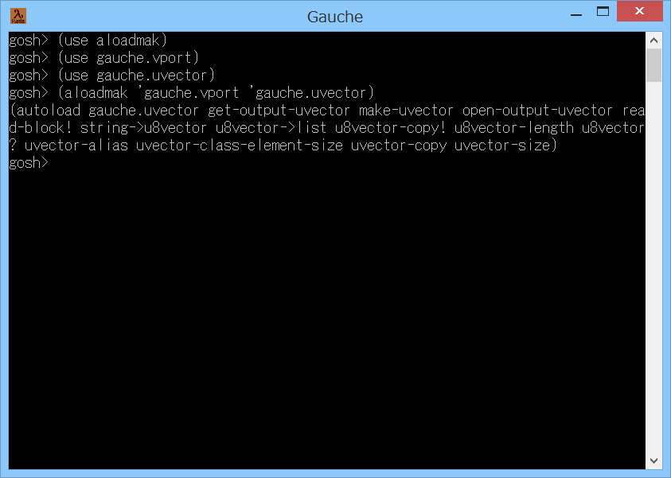

# aloadmak



## 概要
- Gauche で autoload のコードを生成するためのモジュールです。  
  use を autoload に変更してロードを遅延したい場合に使用できます。


## インストール方法
- aloadmak.scm を Gauche でロード可能なフォルダにコピーします。  
  (例えば (gauche-site-library-directory) で表示されるフォルダ等)


## 使い方
- 例えば、moduleA で use している moduleB を  
  autoload に変更したい場合には、以下のように実行します。  
  ```
  (use aloadmak)
  (aloadmak 'moduleA 'moduleB)
  ```
  すると、実行結果として autoload のコードが表示されます。  
  それを moduleA 内の use のコードと差し替えれば、  
  use を autoload に変更することができます。  
  (ただし、後述の注意事項 1. の内容に注意してください)

- aloadmak 手続きの書式は以下の通りです。  
  `aloadmak module-or-file use-module`
  - 第1引数の module-or-file には、対象のモジュールを表すシンボル、または、  
    スクリプトファイル名を指定します。  
    (指定したモジュールまたはスクリプトファイルは、ロード可能である必要があります)

  - 第2引数の use-module には、対象の内部で使用するモジュールを表すシンボルを  
    指定します。  
    (指定したモジュールは、ロード可能である必要があります)

  - 戻り値は、生成した autoload のコードになります。


## 注意事項
1. 単純にシンボルを検索しているため、誤ったコードを生成することがあります。  
   別途、動作確認を実施ください。  
   (例えば、ローカル変数として使用しているシンボルでも、  
   autoload の対象として判定してしまいます)  
   (逆に、シンボルを動的に生成している場合には、判定もれが発生します)

2. むやみに use を autoload に変更すると、プログラムの保守性が悪くなります。  
   ロード時間を測定して、必要な部分にのみ autoload を使用するようにしてください。  
   (ロード時間は、`gosh -pload` で測定できます)


## 環境等
- OS
  - Windows 8.1 (64bit)
- 言語
  - Gauche v0.9.6_pre2
  - Gauche v0.9.5
  - Gauche v0.9.4

## 履歴
- 2017-9-25  v1.00 (初版)
- 2017-9-26  v1.01 コメントと書式修正のみ
- 2017-9-26  v1.02 出力ミス修正
- 2017-9-26  v1.03 対象にスクリプトファイル名を指定可能とした
- 2017-9-26  v1.10 全体見直し(作り直し)
- 2017-9-26  v1.11 aloadmak の第2引数を自動的に use するようにした
- 2017-9-26  v1.12 モジュール取得処理修正等


(2017-9-26)
