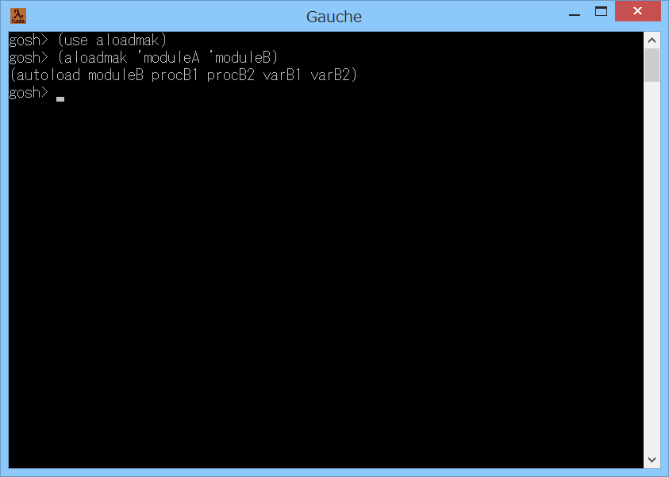

# aloadmak



## 概要
- Gauche で autoload のコードを生成するためのモジュールです。  
  use を autoload に変更してロードを遅延したい場合に使用できます。


## インストール方法
- aloadmak.scm を Gauche でロード可能なフォルダにコピーします。  
  (例えば (gauche-site-library-directory) で表示されるフォルダ等)


## 使い方
- 例えば、gauche.vport で use している gauche.uvector を  
  autoload に変更したい場合には、以下のように実行します。  
  ```
  (use aloadmak)
  (use gauche.vport)
  (use gauche.uvector)
  (aloadmak 'gauche.vport 'gauche.uvector)
  ```
  実行結果として autoload のコードが表示されるので、  
  それを use のコードと差し替えれば、autoload に変更できます。

- aloadmak 手続きの書式は以下の通りです。  
  `aloadmak module use-module`
  - 第1引数の module には、対象モジュールを表すシンボルを指定します。  
    (指定するモジュールは、事前に use 等でロードされている必要があります)
    
  - 第2引数の use-module には、対象モジュール内で使用するモジュールを表す  
    シンボルを指定します。  
    (指定するモジュールは、事前に use 等でロードされている必要があります)
    
  - 戻り値は、生成した autoload のコードになります。


## 注意事項
1. aloadmak モジュールは、gauche.test モジュールの内部の手続きを使用しています。  
   このため、Gauche の将来のバージョンアップで、動作しなくなる可能性があります。

2. 生成される autoload のコードは、完全ではないかもしれません。  
   別途、動作確認を実施ください。


## 環境等
- OS
  - Windows 8.1 (64bit)
- 言語
  - Gauche v0.9.6_pre2
  - Gauche v0.9.5
  - Gauche v0.9.4

## 履歴
- 2017-9-25 v1.00 (初版)


(2017-9-25)
